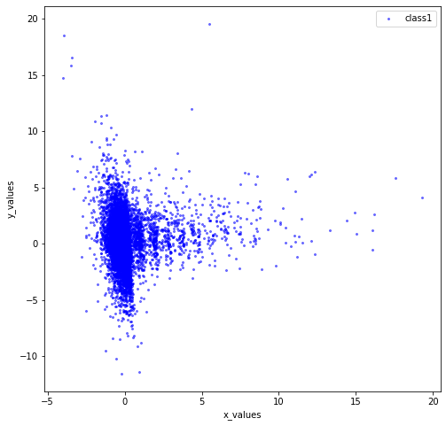
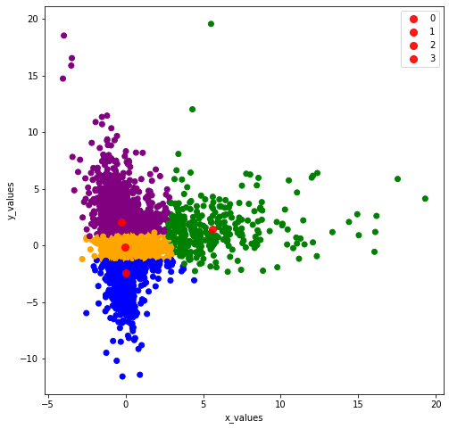
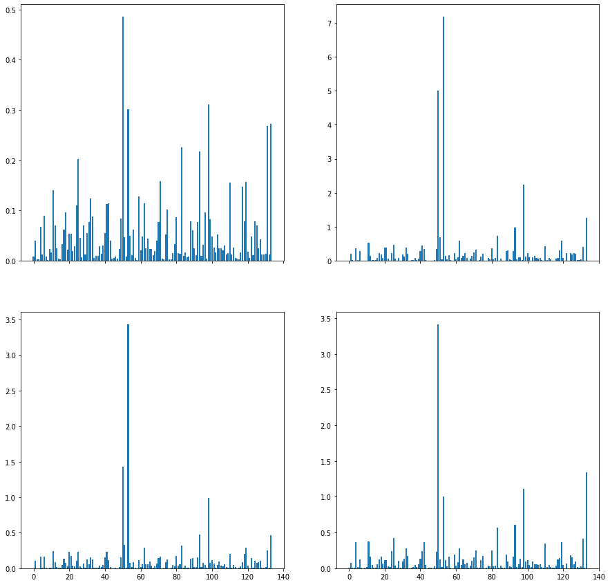

In this notebook I will try to find a possible customer segmenetation enabling to classify customers according the their different purchases. I hope this information will be useful for the next prediction task. Since there are thousands of products in the dataset I will rely on aisles, which represent categories of products. Even with aisles features will be too much so I will use Principal Component Analysis to find new dimensions along which clustering will be easier. I will then try to find possible explanations for the identified clusters.

First Exploration

Data Dictionary:
https://gist.github.com/jeremystan/c3b39d947d9b88b3ccff3147dbcf6c6b

Market Basket Analysis data (Kaggle):
https://www.kaggle.com/c/instacart-market-basket-analysis/data

Instacart Data (public release - article):
https://tech.instacart.com/3-million-instacart-orders-open-sourced-d40d29ead6f2

Citation to add to notebook:
“The Instacart Online Grocery Shopping Dataset 2017”, Accessed from https://www.instacart.com/datasets/grocery-shopping-2017
    
PCA-using-python-scikit-learn : https://towardsdatascience.com/pca-using-python-scikit-learn-e653f8989e60

Customer segments with PCA: https://www.kaggle.com/asindico/customer-segments-with-pca
    
Step By Step PCA Math: https://builtin.com/data-science/step-step-explanation-principal-component-analysis


```python
import numpy as np 
import pandas as pd
```


```python
import os
os.chdir("D:\WorkRepo\instacart-market-basket-analysis\instacart-market-basket-analysis")
```


```python
orders = pd.read_csv('orders.csv')
prior = pd.read_csv('order_products__prior.csv')
```


```python
orders.groupby(orders['eval_set']).count()
```


<div>
<style scoped>
    .dataframe tbody tr th:only-of-type {
        vertical-align: middle;
    }

    .dataframe tbody tr th {
        vertical-align: top;
    }

    .dataframe thead th {
        text-align: right;
    }
</style>
<table border="1" class="dataframe">
  <thead>
    <tr style="text-align: right;">
      <th></th>
      <th>order_id</th>
      <th>user_id</th>
      <th>order_number</th>
      <th>order_dow</th>
      <th>order_hour_of_day</th>
      <th>days_since_prior_order</th>
    </tr>
    <tr>
      <th>eval_set</th>
      <th></th>
      <th></th>
      <th></th>
      <th></th>
      <th></th>
      <th></th>
    </tr>
  </thead>
  <tbody>
    <tr>
      <th>prior</th>
      <td>3214874</td>
      <td>3214874</td>
      <td>3214874</td>
      <td>3214874</td>
      <td>3214874</td>
      <td>3008665</td>
    </tr>
    <tr>
      <th>test</th>
      <td>75000</td>
      <td>75000</td>
      <td>75000</td>
      <td>75000</td>
      <td>75000</td>
      <td>75000</td>
    </tr>
    <tr>
      <th>train</th>
      <td>131209</td>
      <td>131209</td>
      <td>131209</td>
      <td>131209</td>
      <td>131209</td>
      <td>131209</td>
    </tr>
  </tbody>
</table>
</div>


```python
prior.count()
# prior dataset contains more records than order dataset - we can take care of this when joining the two datasets
```


    order_id             32434489
    product_id           32434489
    add_to_cart_order    32434489
    reordered            32434489
    dtype: int64


```python
# Where is my file? Find save location
# https://stackoverflow.com/questions/18901185/ipython-notebook-save-location
#!ipython locate
# Default: C:\Users\Vineet PC\.ipython
```

    
    C:\Users\Vineet PC\.ipython
    


```python
##Due to the number of rows I have to reduce the set of prior data to publish the kernel 
##comment this if you execute it on your local machine
prior = prior[0:300000]
```

Merge two datasets


```python
order_prior = pd.merge(prior,orders,on=['order_id','order_id'])
order_prior = order_prior.sort_values(by=['user_id','order_id'])
order_prior.head()
```


<div>
<style scoped>
    .dataframe tbody tr th:only-of-type {
        vertical-align: middle;
    }

    .dataframe tbody tr th {
        vertical-align: top;
    }

    .dataframe thead th {
        text-align: right;
    }
</style>
<table border="1" class="dataframe">
  <thead>
    <tr style="text-align: right;">
      <th></th>
      <th>order_id</th>
      <th>product_id</th>
      <th>add_to_cart_order</th>
      <th>reordered</th>
      <th>user_id</th>
      <th>eval_set</th>
      <th>order_number</th>
      <th>order_dow</th>
      <th>order_hour_of_day</th>
      <th>days_since_prior_order</th>
    </tr>
  </thead>
  <tbody>
    <tr>
      <th>221645</th>
      <td>23391</td>
      <td>13198</td>
      <td>1</td>
      <td>1</td>
      <td>7</td>
      <td>prior</td>
      <td>17</td>
      <td>0</td>
      <td>10</td>
      <td>28.0</td>
    </tr>
    <tr>
      <th>221646</th>
      <td>23391</td>
      <td>42803</td>
      <td>2</td>
      <td>1</td>
      <td>7</td>
      <td>prior</td>
      <td>17</td>
      <td>0</td>
      <td>10</td>
      <td>28.0</td>
    </tr>
    <tr>
      <th>221647</th>
      <td>23391</td>
      <td>8277</td>
      <td>3</td>
      <td>1</td>
      <td>7</td>
      <td>prior</td>
      <td>17</td>
      <td>0</td>
      <td>10</td>
      <td>28.0</td>
    </tr>
    <tr>
      <th>221648</th>
      <td>23391</td>
      <td>37602</td>
      <td>4</td>
      <td>1</td>
      <td>7</td>
      <td>prior</td>
      <td>17</td>
      <td>0</td>
      <td>10</td>
      <td>28.0</td>
    </tr>
    <tr>
      <th>221649</th>
      <td>23391</td>
      <td>40852</td>
      <td>5</td>
      <td>1</td>
      <td>7</td>
      <td>prior</td>
      <td>17</td>
      <td>0</td>
      <td>10</td>
      <td>28.0</td>
    </tr>
  </tbody>
</table>
</div>


```python
order_prior.count()
```


    order_id                  300000
    product_id                300000
    add_to_cart_order         300000
    reordered                 300000
    user_id                   300000
    eval_set                  300000
    order_number              300000
    order_dow                 300000
    order_hour_of_day         300000
    days_since_prior_order    280806
    dtype: int64


```python
print(order_prior.shape)
```

    (300000, 10)
    

Now loading Products and Aisles datasets and merging them with order_prior


```python
products = pd.read_csv('products.csv')
aisles = pd.read_csv('aisles.csv')
```


```python
products.count()
```


    product_id       49688
    product_name     49688
    aisle_id         49688
    department_id    49688
    dtype: int64


```python
data = pd.merge(prior,products, on = ['product_id','product_id'])
data = pd.merge(data,orders,on=['order_id','order_id'])
data = pd.merge(data,aisles,on=['aisle_id','aisle_id'])
data.head(10)
```


<div>
<style scoped>
    .dataframe tbody tr th:only-of-type {
        vertical-align: middle;
    }

    .dataframe tbody tr th {
        vertical-align: top;
    }

    .dataframe thead th {
        text-align: right;
    }
</style>
<table border="1" class="dataframe">
  <thead>
    <tr style="text-align: right;">
      <th></th>
      <th>order_id</th>
      <th>product_id</th>
      <th>add_to_cart_order</th>
      <th>reordered</th>
      <th>product_name</th>
      <th>aisle_id</th>
      <th>department_id</th>
      <th>user_id</th>
      <th>eval_set</th>
      <th>order_number</th>
      <th>order_dow</th>
      <th>order_hour_of_day</th>
      <th>days_since_prior_order</th>
      <th>aisle</th>
    </tr>
  </thead>
  <tbody>
    <tr>
      <th>0</th>
      <td>2</td>
      <td>33120</td>
      <td>1</td>
      <td>1</td>
      <td>Organic Egg Whites</td>
      <td>86</td>
      <td>16</td>
      <td>202279</td>
      <td>prior</td>
      <td>3</td>
      <td>5</td>
      <td>9</td>
      <td>8.0</td>
      <td>eggs</td>
    </tr>
    <tr>
      <th>1</th>
      <td>26</td>
      <td>33120</td>
      <td>5</td>
      <td>0</td>
      <td>Organic Egg Whites</td>
      <td>86</td>
      <td>16</td>
      <td>153404</td>
      <td>prior</td>
      <td>2</td>
      <td>0</td>
      <td>16</td>
      <td>7.0</td>
      <td>eggs</td>
    </tr>
    <tr>
      <th>2</th>
      <td>120</td>
      <td>33120</td>
      <td>13</td>
      <td>0</td>
      <td>Organic Egg Whites</td>
      <td>86</td>
      <td>16</td>
      <td>23750</td>
      <td>prior</td>
      <td>11</td>
      <td>6</td>
      <td>8</td>
      <td>10.0</td>
      <td>eggs</td>
    </tr>
    <tr>
      <th>3</th>
      <td>327</td>
      <td>33120</td>
      <td>5</td>
      <td>1</td>
      <td>Organic Egg Whites</td>
      <td>86</td>
      <td>16</td>
      <td>58707</td>
      <td>prior</td>
      <td>21</td>
      <td>6</td>
      <td>9</td>
      <td>8.0</td>
      <td>eggs</td>
    </tr>
    <tr>
      <th>4</th>
      <td>390</td>
      <td>33120</td>
      <td>28</td>
      <td>1</td>
      <td>Organic Egg Whites</td>
      <td>86</td>
      <td>16</td>
      <td>166654</td>
      <td>prior</td>
      <td>48</td>
      <td>0</td>
      <td>12</td>
      <td>9.0</td>
      <td>eggs</td>
    </tr>
    <tr>
      <th>5</th>
      <td>537</td>
      <td>33120</td>
      <td>2</td>
      <td>1</td>
      <td>Organic Egg Whites</td>
      <td>86</td>
      <td>16</td>
      <td>180135</td>
      <td>prior</td>
      <td>15</td>
      <td>2</td>
      <td>8</td>
      <td>3.0</td>
      <td>eggs</td>
    </tr>
    <tr>
      <th>6</th>
      <td>582</td>
      <td>33120</td>
      <td>7</td>
      <td>1</td>
      <td>Organic Egg Whites</td>
      <td>86</td>
      <td>16</td>
      <td>193223</td>
      <td>prior</td>
      <td>6</td>
      <td>2</td>
      <td>19</td>
      <td>10.0</td>
      <td>eggs</td>
    </tr>
    <tr>
      <th>7</th>
      <td>608</td>
      <td>33120</td>
      <td>5</td>
      <td>1</td>
      <td>Organic Egg Whites</td>
      <td>86</td>
      <td>16</td>
      <td>91030</td>
      <td>prior</td>
      <td>11</td>
      <td>3</td>
      <td>21</td>
      <td>12.0</td>
      <td>eggs</td>
    </tr>
    <tr>
      <th>8</th>
      <td>623</td>
      <td>33120</td>
      <td>1</td>
      <td>1</td>
      <td>Organic Egg Whites</td>
      <td>86</td>
      <td>16</td>
      <td>37804</td>
      <td>prior</td>
      <td>63</td>
      <td>3</td>
      <td>12</td>
      <td>3.0</td>
      <td>eggs</td>
    </tr>
    <tr>
      <th>9</th>
      <td>689</td>
      <td>33120</td>
      <td>4</td>
      <td>1</td>
      <td>Organic Egg Whites</td>
      <td>86</td>
      <td>16</td>
      <td>108932</td>
      <td>prior</td>
      <td>16</td>
      <td>1</td>
      <td>13</td>
      <td>3.0</td>
      <td>eggs</td>
    </tr>
  </tbody>
</table>
</div>


```python
data.shape
```


    (300000, 14)


```python
# Sneakpeak into product names in products dataset
data['product_name'].value_counts()[0:10]
```


```python
# Count of unique products in the dataset
len(data['product_name'].unique())
```


    24836


```python
# Sneakpeak into aisle names in aisles dataset
data['aisle'].value_counts()[0:10]
```


    fresh fruits                     33755
    fresh vegetables                 31004
    packaged vegetables fruits       16319
    yogurt                           13477
    packaged cheese                   9133
    milk                              8254
    water seltzer sparkling water     7634
    chips pretzels                    6581
    soy lactosefree                   5965
    bread                             5457
    Name: aisle, dtype: int64


**Principal Component Analysis**

Reading [1] and [2] we got to know that we can speed up the fitting of a machine learning algorithm by changing the optimization algorithm. A more common way of speeding up a machine learning algorithm is by using Principal Component Analysis (PCA). If your learning algorithm is too slow because the input dimension is too high, then using PCA to speed it up can be a reasonable choice. This is probably the most common application of PCA. Another common application of PCA is for data visualization.

SKLEARN PCA Library:
https://scikit-learn.org/stable/modules/generated/sklearn.decomposition.PCA.html


References:
[1]: https://towardsdatascience.com/pca-using-python-scikit-learn-e653f8989e60
[2]: https://towardsdatascience.com/logistic-regression-using-python-sklearn-numpy-mnist-handwriting-recognition-matplotlib-a6b31e2b166a


In order to determine possible clusters among the customers, single user_id will need to be substituted with the specific cluster to which they are assumed to belong. Fro this I will create a crosstab of user_id with **aisle** (representing product category).

This should perhaps eventually increase the next prediction model performance.

 -> Creating a dataframe with all the purchases made by each user


```python

cust_prod = pd.crosstab(data['user_id'], data['aisle'])
cust_prod.head(10)
#cust_prod.shape
```


<div>
<style scoped>
    .dataframe tbody tr th:only-of-type {
        vertical-align: middle;
    }

    .dataframe tbody tr th {
        vertical-align: top;
    }

    .dataframe thead th {
        text-align: right;
    }
</style>
<table border="1" class="dataframe">
  <thead>
    <tr style="text-align: right;">
      <th>aisle</th>
      <th>air fresheners candles</th>
      <th>asian foods</th>
      <th>baby accessories</th>
      <th>baby bath body care</th>
      <th>baby food formula</th>
      <th>bakery desserts</th>
      <th>baking ingredients</th>
      <th>baking supplies decor</th>
      <th>beauty</th>
      <th>beers coolers</th>
      <th>...</th>
      <th>spreads</th>
      <th>tea</th>
      <th>tofu meat alternatives</th>
      <th>tortillas flat bread</th>
      <th>trail mix snack mix</th>
      <th>trash bags liners</th>
      <th>vitamins supplements</th>
      <th>water seltzer sparkling water</th>
      <th>white wines</th>
      <th>yogurt</th>
    </tr>
    <tr>
      <th>user_id</th>
      <th></th>
      <th></th>
      <th></th>
      <th></th>
      <th></th>
      <th></th>
      <th></th>
      <th></th>
      <th></th>
      <th></th>
      <th></th>
      <th></th>
      <th></th>
      <th></th>
      <th></th>
      <th></th>
      <th></th>
      <th></th>
      <th></th>
      <th></th>
      <th></th>
    </tr>
  </thead>
  <tbody>
    <tr>
      <th>7</th>
      <td>0</td>
      <td>0</td>
      <td>0</td>
      <td>0</td>
      <td>0</td>
      <td>0</td>
      <td>0</td>
      <td>0</td>
      <td>0</td>
      <td>0</td>
      <td>...</td>
      <td>0</td>
      <td>0</td>
      <td>0</td>
      <td>0</td>
      <td>0</td>
      <td>0</td>
      <td>0</td>
      <td>0</td>
      <td>0</td>
      <td>0</td>
    </tr>
    <tr>
      <th>13</th>
      <td>0</td>
      <td>0</td>
      <td>0</td>
      <td>0</td>
      <td>0</td>
      <td>0</td>
      <td>1</td>
      <td>0</td>
      <td>0</td>
      <td>0</td>
      <td>...</td>
      <td>0</td>
      <td>0</td>
      <td>0</td>
      <td>1</td>
      <td>0</td>
      <td>0</td>
      <td>0</td>
      <td>0</td>
      <td>0</td>
      <td>0</td>
    </tr>
    <tr>
      <th>23</th>
      <td>0</td>
      <td>0</td>
      <td>0</td>
      <td>0</td>
      <td>0</td>
      <td>0</td>
      <td>0</td>
      <td>0</td>
      <td>1</td>
      <td>0</td>
      <td>...</td>
      <td>0</td>
      <td>0</td>
      <td>0</td>
      <td>0</td>
      <td>0</td>
      <td>0</td>
      <td>0</td>
      <td>1</td>
      <td>0</td>
      <td>4</td>
    </tr>
    <tr>
      <th>27</th>
      <td>0</td>
      <td>0</td>
      <td>0</td>
      <td>0</td>
      <td>0</td>
      <td>0</td>
      <td>0</td>
      <td>0</td>
      <td>0</td>
      <td>0</td>
      <td>...</td>
      <td>0</td>
      <td>0</td>
      <td>0</td>
      <td>0</td>
      <td>0</td>
      <td>0</td>
      <td>0</td>
      <td>1</td>
      <td>0</td>
      <td>4</td>
    </tr>
    <tr>
      <th>36</th>
      <td>0</td>
      <td>0</td>
      <td>0</td>
      <td>0</td>
      <td>0</td>
      <td>0</td>
      <td>0</td>
      <td>0</td>
      <td>0</td>
      <td>1</td>
      <td>...</td>
      <td>0</td>
      <td>0</td>
      <td>0</td>
      <td>0</td>
      <td>0</td>
      <td>0</td>
      <td>0</td>
      <td>0</td>
      <td>0</td>
      <td>0</td>
    </tr>
    <tr>
      <th>42</th>
      <td>0</td>
      <td>0</td>
      <td>0</td>
      <td>0</td>
      <td>0</td>
      <td>0</td>
      <td>0</td>
      <td>0</td>
      <td>0</td>
      <td>0</td>
      <td>...</td>
      <td>0</td>
      <td>0</td>
      <td>0</td>
      <td>0</td>
      <td>0</td>
      <td>0</td>
      <td>0</td>
      <td>0</td>
      <td>0</td>
      <td>0</td>
    </tr>
    <tr>
      <th>66</th>
      <td>0</td>
      <td>0</td>
      <td>0</td>
      <td>0</td>
      <td>0</td>
      <td>0</td>
      <td>1</td>
      <td>0</td>
      <td>0</td>
      <td>0</td>
      <td>...</td>
      <td>0</td>
      <td>0</td>
      <td>0</td>
      <td>0</td>
      <td>0</td>
      <td>0</td>
      <td>0</td>
      <td>0</td>
      <td>0</td>
      <td>0</td>
    </tr>
    <tr>
      <th>67</th>
      <td>0</td>
      <td>0</td>
      <td>0</td>
      <td>0</td>
      <td>0</td>
      <td>0</td>
      <td>0</td>
      <td>0</td>
      <td>0</td>
      <td>0</td>
      <td>...</td>
      <td>0</td>
      <td>0</td>
      <td>0</td>
      <td>0</td>
      <td>0</td>
      <td>0</td>
      <td>0</td>
      <td>1</td>
      <td>0</td>
      <td>0</td>
    </tr>
    <tr>
      <th>70</th>
      <td>0</td>
      <td>0</td>
      <td>0</td>
      <td>0</td>
      <td>0</td>
      <td>0</td>
      <td>0</td>
      <td>0</td>
      <td>0</td>
      <td>0</td>
      <td>...</td>
      <td>0</td>
      <td>0</td>
      <td>0</td>
      <td>0</td>
      <td>0</td>
      <td>0</td>
      <td>0</td>
      <td>0</td>
      <td>0</td>
      <td>1</td>
    </tr>
    <tr>
      <th>71</th>
      <td>0</td>
      <td>0</td>
      <td>0</td>
      <td>0</td>
      <td>0</td>
      <td>0</td>
      <td>1</td>
      <td>0</td>
      <td>0</td>
      <td>0</td>
      <td>...</td>
      <td>2</td>
      <td>0</td>
      <td>0</td>
      <td>0</td>
      <td>0</td>
      <td>0</td>
      <td>0</td>
      <td>0</td>
      <td>0</td>
      <td>3</td>
    </tr>
  </tbody>
</table>
<p>10 rows × 134 columns</p>
</div>


Applying PCA from SKLEARN


```python
# !pip install sklearn
```

    Collecting sklearn
      Downloading sklearn-0.0.tar.gz (1.1 kB)
    Collecting scikit-learn
      Downloading scikit_learn-0.23.2-cp38-cp38-win_amd64.whl (6.8 MB)
    Requirement already satisfied: numpy>=1.13.3 in d:\anaconda3\lib\site-packages (from scikit-learn->sklearn) (1.19.4+vanilla)
    Collecting joblib>=0.11
      Downloading joblib-0.17.0-py3-none-any.whl (301 kB)
    Collecting scipy>=0.19.1
      Downloading scipy-1.5.4-cp38-cp38-win_amd64.whl (31.4 MB)
    Collecting threadpoolctl>=2.0.0
      Using cached threadpoolctl-2.1.0-py3-none-any.whl (12 kB)
    Building wheels for collected packages: sklearn
      Building wheel for sklearn (setup.py): started
      Building wheel for sklearn (setup.py): finished with status 'done'
      Created wheel for sklearn: filename=sklearn-0.0-py2.py3-none-any.whl size=1321 sha256=b70bab0ede83657255064a5b829fedfa154db743b2dd7b9330d4c0e4a68d62f0
      Stored in directory: c:\users\vineet pc\appdata\local\pip\cache\wheels\22\0b\40\fd3f795caaa1fb4c6cb738bc1f56100be1e57da95849bfc897
    Successfully built sklearn
    Installing collected packages: joblib, scipy, threadpoolctl, scikit-learn, sklearn
    Successfully installed joblib-0.17.0 scikit-learn-0.23.2 scipy-1.5.4 sklearn-0.0 threadpoolctl-2.1.0
    


```python
from sklearn.decomposition import PCA
pca = PCA(n_components=6)
pca.fit(cust_prod)
pca_samples = pca.transform(cust_prod)
```


```python
#type(pca_samples)
pca_samples = pd.DataFrame(pca_samples, columns = ['PC1', 'PC2', 'PC3', 'PC4','PC5', 'PC6'])
```


```python
pca_samples.head(5)
```


<div>
<style scoped>
    .dataframe tbody tr th:only-of-type {
        vertical-align: middle;
    }

    .dataframe tbody tr th {
        vertical-align: top;
    }

    .dataframe thead th {
        text-align: right;
    }
</style>
<table border="1" class="dataframe">
  <thead>
    <tr style="text-align: right;">
      <th></th>
      <th>PC1</th>
      <th>PC2</th>
      <th>PC3</th>
      <th>PC4</th>
      <th>PC5</th>
      <th>PC6</th>
    </tr>
  </thead>
  <tbody>
    <tr>
      <th>0</th>
      <td>-0.286251</td>
      <td>1.005868</td>
      <td>-1.030292</td>
      <td>-0.898964</td>
      <td>-0.587675</td>
      <td>-0.998982</td>
    </tr>
    <tr>
      <th>1</th>
      <td>-1.972748</td>
      <td>-0.487659</td>
      <td>-0.120541</td>
      <td>0.213091</td>
      <td>0.045931</td>
      <td>-0.182132</td>
    </tr>
    <tr>
      <th>2</th>
      <td>-1.168974</td>
      <td>1.284089</td>
      <td>3.228124</td>
      <td>0.594045</td>
      <td>-0.648822</td>
      <td>-1.091778</td>
    </tr>
    <tr>
      <th>3</th>
      <td>-1.433967</td>
      <td>1.250081</td>
      <td>3.261985</td>
      <td>1.237737</td>
      <td>-0.353525</td>
      <td>-0.346412</td>
    </tr>
    <tr>
      <th>4</th>
      <td>-2.070709</td>
      <td>-0.422148</td>
      <td>-0.101553</td>
      <td>0.278129</td>
      <td>0.005933</td>
      <td>-0.097450</td>
    </tr>
  </tbody>
</table>
</div>


Visualizing the principal components (PC2 and PC5)


```python
from matplotlib import pyplot as plt
from mpl_toolkits.mplot3d import Axes3D
from mpl_toolkits.mplot3d import proj3d
tocluster = pd.DataFrame(pca_samples[['PC5','PC2']])
print (tocluster.shape)
print (tocluster.head())

fig = plt.figure(figsize=(8,8))
plt.plot(tocluster['PC5'], tocluster['PC2'], 'o', markersize=2, color='blue', alpha=0.5, label='class1')

plt.xlabel('x_values')
plt.ylabel('y_values')
plt.legend()
plt.show()
```

    (25831, 2)
            PC5       PC2
    0 -0.587675  1.005868
    1  0.045931 -0.487659
    2 -0.648822  1.284089
    3 -0.353525  1.250081
    4  0.005933 -0.422148
    


    

    


```python
from sklearn.cluster import KMeans
from sklearn.metrics import silhouette_score

clusterer = KMeans(n_clusters=4,random_state=42).fit(tocluster)
centers = clusterer.cluster_centers_
c_preds = clusterer.predict(tocluster)
print(centers)
```

    [[-0.04620596 -0.15279047]
     [-0.00851022 -2.39783038]
     [-0.24921441  2.06678283]
     [ 5.57233012  1.45511416]]
    


```python
print (c_preds[0:100])
```

    [2 0 2 2 0 0 0 0 0 0 1 0 2 0 0 3 0 0 2 0 0 0 0 0 0 2 1 0 0 2 0 0 0 0 0 0 0
     0 0 0 2 0 0 0 0 0 0 0 2 0 0 0 2 0 0 0 2 0 0 0 1 0 0 0 0 0 0 0 1 1 0 0 0 0
     2 2 1 0 0 0 0 0 2 2 0 0 1 2 0 0 0 0 0 2 0 0 2 0 0 0]
    

Visualizing the clusters


```python
import matplotlib
fig = plt.figure(figsize=(8,8))
colors = ['orange','blue','purple','green']
colored = [colors[k] for k in c_preds]
print (colored[0:10])
plt.scatter(tocluster['PC5'],tocluster['PC2'],  color = colored)
for ci,c in enumerate(centers):
    plt.plot(c[0], c[1], 'o', markersize=8, color='red', alpha=0.9, label=''+str(ci))

plt.xlabel('x_values')
plt.ylabel('y_values')
plt.legend()
plt.show()
```

    ['purple', 'orange', 'purple', 'purple', 'orange', 'orange', 'orange', 'orange', 'orange', 'orange']
    


    

    


We have found a possible clustering for our customers. Let's check if we also manage to find some interesting pattern beneath it.


```python
clust_prod = cust_prod.copy()
clust_prod['cluster'] = c_preds

clust_prod.head(10)
```


<div>
<style scoped>
    .dataframe tbody tr th:only-of-type {
        vertical-align: middle;
    }

    .dataframe tbody tr th {
        vertical-align: top;
    }

    .dataframe thead th {
        text-align: right;
    }
</style>
<table border="1" class="dataframe">
  <thead>
    <tr style="text-align: right;">
      <th>aisle</th>
      <th>air fresheners candles</th>
      <th>asian foods</th>
      <th>baby accessories</th>
      <th>baby bath body care</th>
      <th>baby food formula</th>
      <th>bakery desserts</th>
      <th>baking ingredients</th>
      <th>baking supplies decor</th>
      <th>beauty</th>
      <th>beers coolers</th>
      <th>...</th>
      <th>tea</th>
      <th>tofu meat alternatives</th>
      <th>tortillas flat bread</th>
      <th>trail mix snack mix</th>
      <th>trash bags liners</th>
      <th>vitamins supplements</th>
      <th>water seltzer sparkling water</th>
      <th>white wines</th>
      <th>yogurt</th>
      <th>cluster</th>
    </tr>
    <tr>
      <th>user_id</th>
      <th></th>
      <th></th>
      <th></th>
      <th></th>
      <th></th>
      <th></th>
      <th></th>
      <th></th>
      <th></th>
      <th></th>
      <th></th>
      <th></th>
      <th></th>
      <th></th>
      <th></th>
      <th></th>
      <th></th>
      <th></th>
      <th></th>
      <th></th>
      <th></th>
    </tr>
  </thead>
  <tbody>
    <tr>
      <th>7</th>
      <td>0</td>
      <td>0</td>
      <td>0</td>
      <td>0</td>
      <td>0</td>
      <td>0</td>
      <td>0</td>
      <td>0</td>
      <td>0</td>
      <td>0</td>
      <td>...</td>
      <td>0</td>
      <td>0</td>
      <td>0</td>
      <td>0</td>
      <td>0</td>
      <td>0</td>
      <td>0</td>
      <td>0</td>
      <td>0</td>
      <td>0</td>
    </tr>
    <tr>
      <th>13</th>
      <td>0</td>
      <td>0</td>
      <td>0</td>
      <td>0</td>
      <td>0</td>
      <td>0</td>
      <td>1</td>
      <td>0</td>
      <td>0</td>
      <td>0</td>
      <td>...</td>
      <td>0</td>
      <td>0</td>
      <td>1</td>
      <td>0</td>
      <td>0</td>
      <td>0</td>
      <td>0</td>
      <td>0</td>
      <td>0</td>
      <td>0</td>
    </tr>
    <tr>
      <th>23</th>
      <td>0</td>
      <td>0</td>
      <td>0</td>
      <td>0</td>
      <td>0</td>
      <td>0</td>
      <td>0</td>
      <td>0</td>
      <td>1</td>
      <td>0</td>
      <td>...</td>
      <td>0</td>
      <td>0</td>
      <td>0</td>
      <td>0</td>
      <td>0</td>
      <td>0</td>
      <td>1</td>
      <td>0</td>
      <td>4</td>
      <td>0</td>
    </tr>
    <tr>
      <th>27</th>
      <td>0</td>
      <td>0</td>
      <td>0</td>
      <td>0</td>
      <td>0</td>
      <td>0</td>
      <td>0</td>
      <td>0</td>
      <td>0</td>
      <td>0</td>
      <td>...</td>
      <td>0</td>
      <td>0</td>
      <td>0</td>
      <td>0</td>
      <td>0</td>
      <td>0</td>
      <td>1</td>
      <td>0</td>
      <td>4</td>
      <td>0</td>
    </tr>
    <tr>
      <th>36</th>
      <td>0</td>
      <td>0</td>
      <td>0</td>
      <td>0</td>
      <td>0</td>
      <td>0</td>
      <td>0</td>
      <td>0</td>
      <td>0</td>
      <td>1</td>
      <td>...</td>
      <td>0</td>
      <td>0</td>
      <td>0</td>
      <td>0</td>
      <td>0</td>
      <td>0</td>
      <td>0</td>
      <td>0</td>
      <td>0</td>
      <td>0</td>
    </tr>
    <tr>
      <th>42</th>
      <td>0</td>
      <td>0</td>
      <td>0</td>
      <td>0</td>
      <td>0</td>
      <td>0</td>
      <td>0</td>
      <td>0</td>
      <td>0</td>
      <td>0</td>
      <td>...</td>
      <td>0</td>
      <td>0</td>
      <td>0</td>
      <td>0</td>
      <td>0</td>
      <td>0</td>
      <td>0</td>
      <td>0</td>
      <td>0</td>
      <td>0</td>
    </tr>
    <tr>
      <th>66</th>
      <td>0</td>
      <td>0</td>
      <td>0</td>
      <td>0</td>
      <td>0</td>
      <td>0</td>
      <td>1</td>
      <td>0</td>
      <td>0</td>
      <td>0</td>
      <td>...</td>
      <td>0</td>
      <td>0</td>
      <td>0</td>
      <td>0</td>
      <td>0</td>
      <td>0</td>
      <td>0</td>
      <td>0</td>
      <td>0</td>
      <td>0</td>
    </tr>
    <tr>
      <th>67</th>
      <td>0</td>
      <td>0</td>
      <td>0</td>
      <td>0</td>
      <td>0</td>
      <td>0</td>
      <td>0</td>
      <td>0</td>
      <td>0</td>
      <td>0</td>
      <td>...</td>
      <td>0</td>
      <td>0</td>
      <td>0</td>
      <td>0</td>
      <td>0</td>
      <td>0</td>
      <td>1</td>
      <td>0</td>
      <td>0</td>
      <td>0</td>
    </tr>
    <tr>
      <th>70</th>
      <td>0</td>
      <td>0</td>
      <td>0</td>
      <td>0</td>
      <td>0</td>
      <td>0</td>
      <td>0</td>
      <td>0</td>
      <td>0</td>
      <td>0</td>
      <td>...</td>
      <td>0</td>
      <td>0</td>
      <td>0</td>
      <td>0</td>
      <td>0</td>
      <td>0</td>
      <td>0</td>
      <td>0</td>
      <td>1</td>
      <td>0</td>
    </tr>
    <tr>
      <th>71</th>
      <td>0</td>
      <td>0</td>
      <td>0</td>
      <td>0</td>
      <td>0</td>
      <td>0</td>
      <td>1</td>
      <td>0</td>
      <td>0</td>
      <td>0</td>
      <td>...</td>
      <td>0</td>
      <td>0</td>
      <td>0</td>
      <td>0</td>
      <td>0</td>
      <td>0</td>
      <td>0</td>
      <td>0</td>
      <td>3</td>
      <td>2</td>
    </tr>
  </tbody>
</table>
<p>10 rows × 135 columns</p>
</div>


See the shape of our product-clustrers dataframe for Cluster # 0


```python
clust_prod[clust_prod['cluster']==0]
# 16294 rows × 135 columns
```


<div>
<style scoped>
    .dataframe tbody tr th:only-of-type {
        vertical-align: middle;
    }

    .dataframe tbody tr th {
        vertical-align: top;
    }

    .dataframe thead th {
        text-align: right;
    }
</style>
<table border="1" class="dataframe">
  <thead>
    <tr style="text-align: right;">
      <th>aisle</th>
      <th>air fresheners candles</th>
      <th>asian foods</th>
      <th>baby accessories</th>
      <th>baby bath body care</th>
      <th>baby food formula</th>
      <th>bakery desserts</th>
      <th>baking ingredients</th>
      <th>baking supplies decor</th>
      <th>beauty</th>
      <th>beers coolers</th>
      <th>...</th>
      <th>tea</th>
      <th>tofu meat alternatives</th>
      <th>tortillas flat bread</th>
      <th>trail mix snack mix</th>
      <th>trash bags liners</th>
      <th>vitamins supplements</th>
      <th>water seltzer sparkling water</th>
      <th>white wines</th>
      <th>yogurt</th>
      <th>cluster</th>
    </tr>
    <tr>
      <th>user_id</th>
      <th></th>
      <th></th>
      <th></th>
      <th></th>
      <th></th>
      <th></th>
      <th></th>
      <th></th>
      <th></th>
      <th></th>
      <th></th>
      <th></th>
      <th></th>
      <th></th>
      <th></th>
      <th></th>
      <th></th>
      <th></th>
      <th></th>
      <th></th>
      <th></th>
    </tr>
  </thead>
  <tbody>
    <tr>
      <th>7</th>
      <td>0</td>
      <td>0</td>
      <td>0</td>
      <td>0</td>
      <td>0</td>
      <td>0</td>
      <td>0</td>
      <td>0</td>
      <td>0</td>
      <td>0</td>
      <td>...</td>
      <td>0</td>
      <td>0</td>
      <td>0</td>
      <td>0</td>
      <td>0</td>
      <td>0</td>
      <td>0</td>
      <td>0</td>
      <td>0</td>
      <td>0</td>
    </tr>
    <tr>
      <th>13</th>
      <td>0</td>
      <td>0</td>
      <td>0</td>
      <td>0</td>
      <td>0</td>
      <td>0</td>
      <td>1</td>
      <td>0</td>
      <td>0</td>
      <td>0</td>
      <td>...</td>
      <td>0</td>
      <td>0</td>
      <td>1</td>
      <td>0</td>
      <td>0</td>
      <td>0</td>
      <td>0</td>
      <td>0</td>
      <td>0</td>
      <td>0</td>
    </tr>
    <tr>
      <th>23</th>
      <td>0</td>
      <td>0</td>
      <td>0</td>
      <td>0</td>
      <td>0</td>
      <td>0</td>
      <td>0</td>
      <td>0</td>
      <td>1</td>
      <td>0</td>
      <td>...</td>
      <td>0</td>
      <td>0</td>
      <td>0</td>
      <td>0</td>
      <td>0</td>
      <td>0</td>
      <td>1</td>
      <td>0</td>
      <td>4</td>
      <td>0</td>
    </tr>
    <tr>
      <th>27</th>
      <td>0</td>
      <td>0</td>
      <td>0</td>
      <td>0</td>
      <td>0</td>
      <td>0</td>
      <td>0</td>
      <td>0</td>
      <td>0</td>
      <td>0</td>
      <td>...</td>
      <td>0</td>
      <td>0</td>
      <td>0</td>
      <td>0</td>
      <td>0</td>
      <td>0</td>
      <td>1</td>
      <td>0</td>
      <td>4</td>
      <td>0</td>
    </tr>
    <tr>
      <th>36</th>
      <td>0</td>
      <td>0</td>
      <td>0</td>
      <td>0</td>
      <td>0</td>
      <td>0</td>
      <td>0</td>
      <td>0</td>
      <td>0</td>
      <td>1</td>
      <td>...</td>
      <td>0</td>
      <td>0</td>
      <td>0</td>
      <td>0</td>
      <td>0</td>
      <td>0</td>
      <td>0</td>
      <td>0</td>
      <td>0</td>
      <td>0</td>
    </tr>
    <tr>
      <th>...</th>
      <td>...</td>
      <td>...</td>
      <td>...</td>
      <td>...</td>
      <td>...</td>
      <td>...</td>
      <td>...</td>
      <td>...</td>
      <td>...</td>
      <td>...</td>
      <td>...</td>
      <td>...</td>
      <td>...</td>
      <td>...</td>
      <td>...</td>
      <td>...</td>
      <td>...</td>
      <td>...</td>
      <td>...</td>
      <td>...</td>
      <td>...</td>
    </tr>
    <tr>
      <th>206162</th>
      <td>0</td>
      <td>0</td>
      <td>0</td>
      <td>0</td>
      <td>0</td>
      <td>0</td>
      <td>0</td>
      <td>0</td>
      <td>0</td>
      <td>0</td>
      <td>...</td>
      <td>0</td>
      <td>0</td>
      <td>0</td>
      <td>0</td>
      <td>0</td>
      <td>0</td>
      <td>0</td>
      <td>0</td>
      <td>4</td>
      <td>0</td>
    </tr>
    <tr>
      <th>206165</th>
      <td>0</td>
      <td>0</td>
      <td>0</td>
      <td>0</td>
      <td>0</td>
      <td>0</td>
      <td>0</td>
      <td>0</td>
      <td>0</td>
      <td>0</td>
      <td>...</td>
      <td>0</td>
      <td>0</td>
      <td>0</td>
      <td>0</td>
      <td>0</td>
      <td>0</td>
      <td>0</td>
      <td>0</td>
      <td>0</td>
      <td>0</td>
    </tr>
    <tr>
      <th>206201</th>
      <td>0</td>
      <td>0</td>
      <td>0</td>
      <td>0</td>
      <td>0</td>
      <td>0</td>
      <td>2</td>
      <td>0</td>
      <td>0</td>
      <td>0</td>
      <td>...</td>
      <td>0</td>
      <td>0</td>
      <td>0</td>
      <td>0</td>
      <td>0</td>
      <td>0</td>
      <td>0</td>
      <td>0</td>
      <td>0</td>
      <td>0</td>
    </tr>
    <tr>
      <th>206206</th>
      <td>0</td>
      <td>0</td>
      <td>0</td>
      <td>0</td>
      <td>0</td>
      <td>0</td>
      <td>0</td>
      <td>0</td>
      <td>0</td>
      <td>0</td>
      <td>...</td>
      <td>0</td>
      <td>0</td>
      <td>0</td>
      <td>0</td>
      <td>0</td>
      <td>0</td>
      <td>0</td>
      <td>0</td>
      <td>0</td>
      <td>0</td>
    </tr>
    <tr>
      <th>206207</th>
      <td>0</td>
      <td>0</td>
      <td>0</td>
      <td>0</td>
      <td>0</td>
      <td>0</td>
      <td>0</td>
      <td>0</td>
      <td>0</td>
      <td>0</td>
      <td>...</td>
      <td>0</td>
      <td>0</td>
      <td>0</td>
      <td>0</td>
      <td>0</td>
      <td>0</td>
      <td>1</td>
      <td>0</td>
      <td>1</td>
      <td>0</td>
    </tr>
  </tbody>
</table>
<p>16294 rows × 135 columns</p>
</div>


Creating subplots (2 X 2) = 4


```python
# Subplots structure
f,arr = plt.subplots(2,2,sharex=True,figsize=(15,15))

# Size of data (count of records) for Cluster number = 0
#c1_count = len(clust_prod[clust_prod['cluster']==0])

# Average number of records (customers) in each product category for Cluster number = 0
c0 = clust_prod[clust_prod['cluster']==0].drop('cluster',axis=1).mean()

# In subplot (# 0,0), plot Average number of customers in each product category in Cluster number = 0
# Using bargraph
arr[0,0].bar(range(len(clust_prod.drop('cluster',axis=1).columns)),c0)

# Average number of records (customers) in each product category for Cluster number = 1
c1 = clust_prod[clust_prod['cluster']==1].drop('cluster',axis=1).mean()

# In subplot (# 0,1), plot Average number of customers in each product category in Cluster number = 1
# Using bargraph
arr[0,1].bar(range(len(clust_prod.drop('cluster',axis=1).columns)),c1)

# Cluster 2
c2 = clust_prod[clust_prod['cluster']==2].drop('cluster',axis=1).mean()
arr[1,0].bar(range(len(clust_prod.drop('cluster',axis=1).columns)),c2)

# Cluster 3
c3 = clust_prod[clust_prod['cluster']==3].drop('cluster',axis=1).mean()
arr[1,1].bar(range(len(clust_prod.drop('cluster',axis=1).columns)),c3)

plt.show()

```


    

    


1. What are the top 10 items in each cluster?


```python
c0.nlargest(10)
#c1.nlargest(10)
#c2.nlargest(10)
#c3.nlargest(10)
```


    aisle
    fresh fruits                     0.485884
    packaged vegetables fruits       0.311157
    fresh vegetables                 0.301706
    yogurt                           0.272677
    water seltzer sparkling water    0.268381
    milk                             0.225175
    packaged cheese                  0.216890
    chips pretzels                   0.201853
    ice cream ice                    0.158218
    soy lactosefree                  0.157543
    dtype: float64


2. What are the top 10 items in all clusters combined?

To find this out, we combine all the cluser averages dataseries, group by their indicies keeping only the first occurances thereby eliminating the duplicates in the combined series, and finally keeping the top 10


```python
cp = c0.append(c1)
cp = cp.append(c2)
cp = cp.append(c3)
cp
# This obviously contains duplicates - indices could be the same, however averages may differ among clusters
```


    aisle
    air fresheners candles           0.008347
    asian foods                      0.040015
    baby accessories                 0.002148
    baby bath body care              0.002639
    baby food formula                0.067203
                                       ...   
    trash bags liners                0.012523
    vitamins supplements             0.025046
    water seltzer sparkling water    0.414425
    white wines                      0.004870
    yogurt                           1.345083
    Length: 536, dtype: float64


```python
cp = cp.groupby(cp.index).first()
```

3. cluster analysis confirms the initial hypothesis that below products are genereically bought by the majority of the customers.


```python
cp.nlargest(8)
```


    aisle
    fresh fruits                     0.485884
    packaged vegetables fruits       0.311157
    fresh vegetables                 0.301706
    yogurt                           0.272677
    water seltzer sparkling water    0.268381
    milk                             0.225175
    packaged cheese                  0.216890
    chips pretzels                   0.201853
    dtype: float64


4. Let us inspect if the clusters differ in quantities and proportions, with respect to the product categories, or if a cluster is characterized by some goods not included in this list. For instance we can already see cluster 3 is most characterized by 'Fresh Fruits' whereas most of the other clusters are characterized by 'Fresh Vegetables'.


```python
from IPython.display import display, HTML
cluster_means = [[c0['fresh fruits'],c0['fresh vegetables'],c0['packaged vegetables fruits'], c0['yogurt'], c0['packaged cheese'], c0['milk'],c0['water seltzer sparkling water'],c0['chips pretzels']],
                 [c1['fresh fruits'],c1['fresh vegetables'],c1['packaged vegetables fruits'], c1['yogurt'], c1['packaged cheese'], c1['milk'],c1['water seltzer sparkling water'],c1['chips pretzels']],
                 [c2['fresh fruits'],c2['fresh vegetables'],c2['packaged vegetables fruits'], c2['yogurt'], c2['packaged cheese'], c2['milk'],c2['water seltzer sparkling water'],c2['chips pretzels']],
                 [c3['fresh fruits'],c3['fresh vegetables'],c3['packaged vegetables fruits'], c3['yogurt'], c3['packaged cheese'], c3['milk'],c3['water seltzer sparkling water'],c3['chips pretzels']]]
cluster_means = pd.DataFrame(cluster_means, columns = ['fresh fruits','fresh vegetables','packaged vegetables fruits','yogurt','packaged cheese','milk','water seltzer sparkling water','chips pretzels'])
HTML(cluster_means.to_html())
```


<table border="1" class="dataframe">
  <thead>
    <tr style="text-align: right;">
      <th></th>
      <th>fresh fruits</th>
      <th>fresh vegetables</th>
      <th>packaged vegetables fruits</th>
      <th>yogurt</th>
      <th>packaged cheese</th>
      <th>milk</th>
      <th>water seltzer sparkling water</th>
      <th>chips pretzels</th>
    </tr>
  </thead>
  <tbody>
    <tr>
      <th>0</th>
      <td>0.485884</td>
      <td>0.301706</td>
      <td>0.311157</td>
      <td>0.272677</td>
      <td>0.216890</td>
      <td>0.225175</td>
      <td>0.268381</td>
      <td>0.201853</td>
    </tr>
    <tr>
      <th>1</th>
      <td>4.998037</td>
      <td>7.183513</td>
      <td>2.247301</td>
      <td>1.256133</td>
      <td>0.971541</td>
      <td>0.738960</td>
      <td>0.410206</td>
      <td>0.460255</td>
    </tr>
    <tr>
      <th>2</th>
      <td>1.430813</td>
      <td>3.436757</td>
      <td>0.991441</td>
      <td>0.464574</td>
      <td>0.476700</td>
      <td>0.323348</td>
      <td>0.251070</td>
      <td>0.236091</td>
    </tr>
    <tr>
      <th>3</th>
      <td>3.415353</td>
      <td>1.000232</td>
      <td>1.110622</td>
      <td>1.345083</td>
      <td>0.603896</td>
      <td>0.573284</td>
      <td>0.414425</td>
      <td>0.424397</td>
    </tr>
  </tbody>
</table>


```python
cluster_perc = cluster_means.iloc[:, :].apply(lambda x: (x / x.sum())*100,axis=1)
HTML(cluster_perc.to_html())
```


<table border="1" class="dataframe">
  <thead>
    <tr style="text-align: right;">
      <th></th>
      <th>fresh fruits</th>
      <th>fresh vegetables</th>
      <th>packaged vegetables fruits</th>
      <th>yogurt</th>
      <th>packaged cheese</th>
      <th>milk</th>
      <th>water seltzer sparkling water</th>
      <th>chips pretzels</th>
    </tr>
  </thead>
  <tbody>
    <tr>
      <th>0</th>
      <td>21.275967</td>
      <td>13.211147</td>
      <td>13.625003</td>
      <td>11.940018</td>
      <td>9.497192</td>
      <td>9.859988</td>
      <td>11.751901</td>
      <td>8.838784</td>
    </tr>
    <tr>
      <th>1</th>
      <td>27.362596</td>
      <td>39.327352</td>
      <td>12.303229</td>
      <td>6.876914</td>
      <td>5.318863</td>
      <td>4.045560</td>
      <td>2.245742</td>
      <td>2.519744</td>
    </tr>
    <tr>
      <th>2</th>
      <td>18.799788</td>
      <td>45.156353</td>
      <td>13.026772</td>
      <td>6.104152</td>
      <td>6.263472</td>
      <td>4.248540</td>
      <td>3.298866</td>
      <td>3.102059</td>
    </tr>
    <tr>
      <th>3</th>
      <td>38.429623</td>
      <td>11.254632</td>
      <td>12.496738</td>
      <td>15.134909</td>
      <td>6.795052</td>
      <td>6.450603</td>
      <td>4.663118</td>
      <td>4.775325</td>
    </tr>
  </tbody>
</table>


5. Above table depicts the percentage of these products with respect to the other top 8 in each cluster. We can see some interesting differences among the clusters.

- It seems that customers in cluster 2 buy more fresh vegetables than those in other clusters.
- Customers in cluster 3 buy more fresh fruits and yogurt than those in the other clusters.

Lets look at the 8th to 15th most bought products for each cluster. These will not include the generic products (i.e. vegetables, fruits, water, etc.) so we may find somthing interesting.


```python
c0.sort_values(ascending=False)[8:15]
```


    aisle
    ice cream ice      0.158218
    soy lactosefree    0.157543
    refrigerated       0.155701
    soft drinks        0.147048
    bread              0.141095
    frozen meals       0.127470
    crackers           0.124340
    dtype: float64


```python
c1.sort_values(ascending=False)[8:15]
```


    aisle
    soy lactosefree                  0.582924
    bread                            0.521099
    chips pretzels                   0.460255
    eggs                             0.439647
    refrigerated                     0.420020
    water seltzer sparkling water    0.410206
    canned meals beans               0.393523
    dtype: float64


```python
c2.sort_values(ascending=False)[8:15]
```


    aisle
    frozen produce                   0.290300
    water seltzer sparkling water    0.251070
    bread                            0.240846
    chips pretzels                   0.236091
    canned jarred vegetables         0.230861
    eggs                             0.230385
    soup broth bouillon              0.206847
    dtype: float64


```python
c3.sort_values(ascending=False)[8:15]
```


    aisle
    bread                  0.374304
    energy granola bars    0.368738
    baby food formula      0.364332
    soy lactosefree        0.364332
    refrigerated           0.348794
    crackers               0.283395
    frozen produce         0.282236
    dtype: float64


```python
'''

d0 = pd.DataFrame({'Products':c0.index, 'Averages':c0.values})
d0.sort_values('Averages', ascending=False)[0:10]

d1 = pd.DataFrame({'Products':c1.index, 'Averages':c1.values})
d1.sort_values('Averages', ascending=False)[0:10]

d2 = pd.DataFrame({'Products':c2.index, 'Averages':c2.values})
d2.sort_values('Averages', ascending=False)[0:10]

d3 = pd.DataFrame({'Products':c3.index, 'Averages':c3.values})
d3.sort_values('Averages', ascending=False)[0:10]

'''
```


<div>
<style scoped>
    .dataframe tbody tr th:only-of-type {
        vertical-align: middle;
    }

    .dataframe tbody tr th {
        vertical-align: top;
    }

    .dataframe thead th {
        text-align: right;
    }
</style>
<table border="1" class="dataframe">
  <thead>
    <tr style="text-align: right;">
      <th></th>
      <th>Products</th>
      <th>Averages</th>
    </tr>
  </thead>
  <tbody>
    <tr>
      <th>50</th>
      <td>fresh fruits</td>
      <td>3.415353</td>
    </tr>
    <tr>
      <th>133</th>
      <td>yogurt</td>
      <td>1.345083</td>
    </tr>
    <tr>
      <th>98</th>
      <td>packaged vegetables fruits</td>
      <td>1.110622</td>
    </tr>
    <tr>
      <th>53</th>
      <td>fresh vegetables</td>
      <td>1.000232</td>
    </tr>
    <tr>
      <th>93</th>
      <td>packaged cheese</td>
      <td>0.603896</td>
    </tr>
    <tr>
      <th>83</th>
      <td>milk</td>
      <td>0.573284</td>
    </tr>
    <tr>
      <th>25</th>
      <td>chips pretzels</td>
      <td>0.424397</td>
    </tr>
    <tr>
      <th>131</th>
      <td>water seltzer sparkling water</td>
      <td>0.414425</td>
    </tr>
    <tr>
      <th>11</th>
      <td>bread</td>
      <td>0.374304</td>
    </tr>
    <tr>
      <th>42</th>
      <td>energy granola bars</td>
      <td>0.368738</td>
    </tr>
  </tbody>
</table>
</div>


